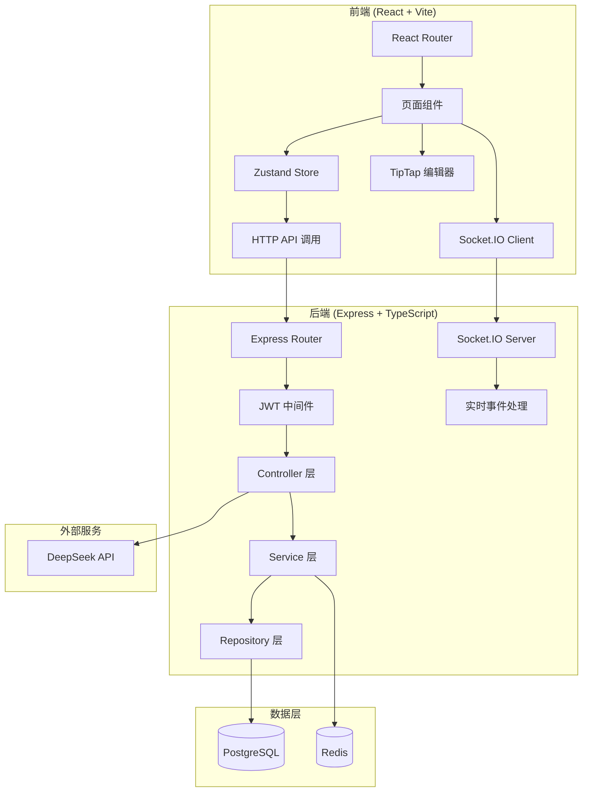
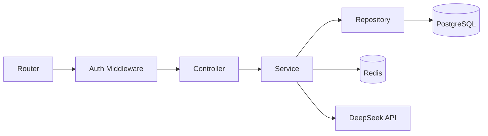
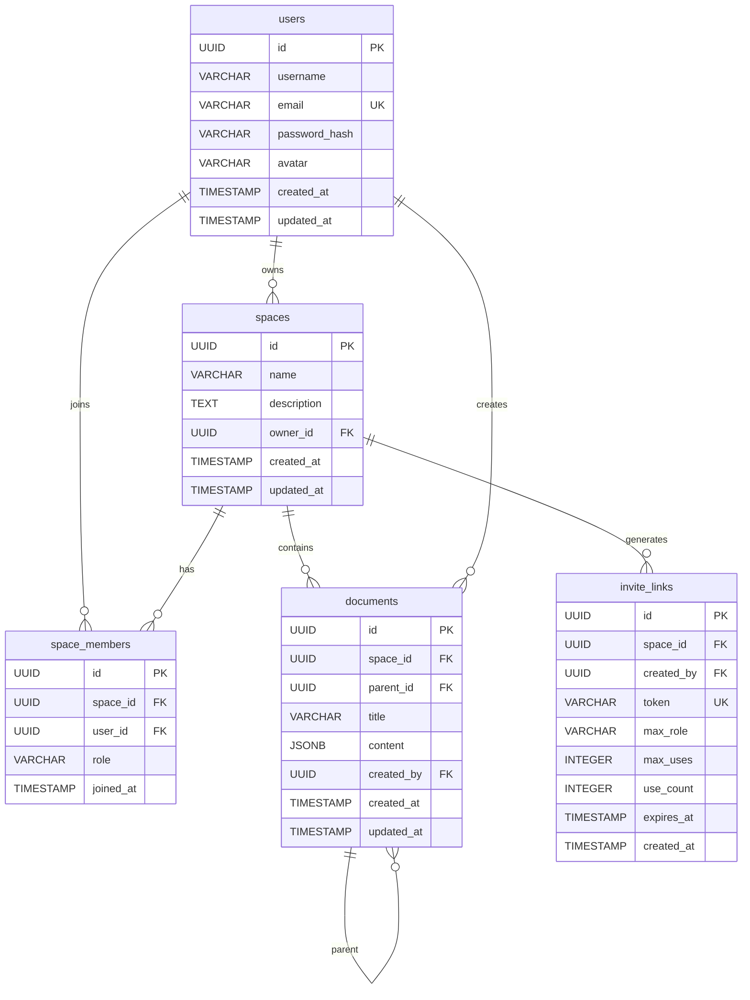

## 1. 架构设计



## 2. 技术说明

- **前端**：React 18 + TypeScript + TailwindCSS 3 + Vite
- **状态管理**：Zustand
- **实时通信**：Socket.IO Client / Server
- **富文本编辑**：TipTap（内置协同支持）
- **初始化工具**：vite-init (react-express-ts 模板)
- **后端**：Express 4 + TypeScript (ESM 格式)
- **数据库**：PostgreSQL 15+
- **缓存**：Redis 7+ (会话管理、邀请链接缓存)
- **AI 集成**：DeepSeek API (兼容 OpenAI SDK)
- **认证**：JWT (access token + refresh token)
- **密码加密**：bcrypt
- **文件上传**：Multer (头像上传)

## 3. 路由定义

### 3.1 前端路由

| 路由 | 用途 | 是否需要认证 |
|------|------|------------|
| `/login` | 登录页面 | 否 |
| `/register` | 注册页面 | 否 |
| `/dashboard` | 空间仪表盘 | 是 |
| `/space/:spaceId` | 空间详情页 | 是 |
| `/doc/:docId` | 文档编辑页 | 是 |

### 3.2 后端 API 路由

| 方法 | 路由 | 用途 | 是否需要认证 |
|------|------|------|------------|
| POST | `/api/auth/register` | 用户注册 | 否 |
| POST | `/api/auth/login` | 用户登录 | 否 |
| POST | `/api/auth/refresh` | 刷新 Token | 否 |
| GET | `/api/auth/me` | 获取当前用户信息 | 是 |
| POST | `/api/auth/avatar` | 上传头像 | 是 |
| GET | `/api/spaces` | 获取用户加入的空间列表 | 是 |
| POST | `/api/spaces` | 创建空间 | 是 |
| GET | `/api/spaces/:spaceId` | 获取空间详情 | 是 |
| PATCH | `/api/spaces/:spaceId` | 更新空间信息 | 是 |
| DELETE | `/api/spaces/:spaceId` | 删除空间 (仅 owner) | 是 |
| POST | `/api/spaces/:spaceId/invite` | 生成邀请链接 | 是 |
| POST | `/api/spaces/join/:token` | 通过邀请链接加入空间 | 是 |
| GET | `/api/spaces/:spaceId/members` | 获取空间成员列表 | 是 |
| PATCH | `/api/spaces/:spaceId/members/:userId` | 更新成员角色 | 是 |
| DELETE | `/api/spaces/:spaceId/members/:userId` | 移除成员 | 是 |
| GET | `/api/spaces/:spaceId/documents` | 获取空间文档列表 | 是 |
| POST | `/api/spaces/:spaceId/documents` | 创建文档 | 是 |
| GET | `/api/documents/:docId` | 获取文档详情 | 是 |
| PATCH | `/api/documents/:docId` | 更新文档内容 | 是 |
| DELETE | `/api/documents/:docId` | 删除文档 | 是 |
| POST | `/api/ai/chat` | AI 对话 (流式 SSE) | 是 |

## 4. API 定义

### 4.1 认证相关

```typescript
interface RegisterRequest {
  username: string;
  email: string;
  password: string;
}

interface LoginRequest {
  email: string;
  password: string;
}

interface AuthResponse {
  user: {
    id: string;
    username: string;
    email: string;
    avatar: string | null;
  };
  accessToken: string;
  refreshToken: string;
}
```

### 4.2 空间相关

```typescript
interface CreateSpaceRequest {
  name: string;
  description?: string;
}

interface SpaceResponse {
  id: string;
  name: string;
  description: string | null;
  owner_id: string;
  member_count: number;
  document_count: number;
  role: 'owner' | 'admin' | 'member';
  created_at: string;
}

interface InviteResponse {
  token: string;
  expires_at: string;
}

interface SpaceMemberResponse {
  user_id: string;
  username: string;
  email: string;
  avatar: string | null;
  role: 'owner' | 'admin' | 'member';
  joined_at: string;
}
```

### 4.3 文档相关

```typescript
interface CreateDocumentRequest {
  title: string;
  parent_id?: string;
}

interface DocumentResponse {
  id: string;
  space_id: string;
  title: string;
  content: any;
  created_by: string;
  updated_at: string;
  created_at: string;
}
```

### 4.4 AI 对话

```typescript
interface ChatRequest {
  messages: {
    role: 'user' | 'assistant' | 'system';
    content: string;
  }[];
  context?: string;
}
```

## 5. 服务端架构图



### 目录结构

```
api/
├── src/
│   ├── config/          # 配置 (DB, Redis, JWT 等)
│   ├── middleware/       # JWT 认证中间件, 错误处理
│   ├── modules/
│   │   ├── auth/        # 认证模块 (controller, service, repository, routes)
│   │   ├── space/       # 空间模块
│   │   ├── document/    # 文档模块
│   │   └── ai/          # AI 对话模块
│   ├── socket/          # Socket.IO 事件处理
│   ├── utils/           # 工具函数
│   └── app.ts           # Express 应用入口
├── migrations/          # 数据库迁移 SQL
└── package.json
```

## 6. 数据模型

### 6.1 数据模型定义



### 6.2 数据定义语言

```sql
-- 用户表
CREATE TABLE users (
    id UUID PRIMARY KEY DEFAULT gen_random_uuid(),
    username VARCHAR(50) NOT NULL,
    email VARCHAR(255) UNIQUE NOT NULL,
    password_hash VARCHAR(255) NOT NULL,
    avatar VARCHAR(500),
    created_at TIMESTAMP DEFAULT NOW(),
    updated_at TIMESTAMP DEFAULT NOW()
);

-- 空间表
CREATE TABLE spaces (
    id UUID PRIMARY KEY DEFAULT gen_random_uuid(),
    name VARCHAR(100) NOT NULL,
    description TEXT,
    owner_id UUID NOT NULL REFERENCES users(id) ON DELETE CASCADE,
    created_at TIMESTAMP DEFAULT NOW(),
    updated_at TIMESTAMP DEFAULT NOW()
);

-- 空间成员表
CREATE TABLE space_members (
    id UUID PRIMARY KEY DEFAULT gen_random_uuid(),
    space_id UUID NOT NULL REFERENCES spaces(id) ON DELETE CASCADE,
    user_id UUID NOT NULL REFERENCES users(id) ON DELETE CASCADE,
    role VARCHAR(20) NOT NULL DEFAULT 'member',
    joined_at TIMESTAMP DEFAULT NOW(),
    UNIQUE(space_id, user_id)
);

-- 文档表
CREATE TABLE documents (
    id UUID PRIMARY KEY DEFAULT gen_random_uuid(),
    space_id UUID NOT NULL REFERENCES spaces(id) ON DELETE CASCADE,
    parent_id UUID REFERENCES documents(id) ON DELETE SET NULL,
    title VARCHAR(255) NOT NULL DEFAULT '未命名文档',
    content JSONB DEFAULT '{}',
    created_by UUID NOT NULL REFERENCES users(id),
    created_at TIMESTAMP DEFAULT NOW(),
    updated_at TIMESTAMP DEFAULT NOW()
);

-- 邀请链接表
CREATE TABLE invite_links (
    id UUID PRIMARY KEY DEFAULT gen_random_uuid(),
    space_id UUID NOT NULL REFERENCES spaces(id) ON DELETE CASCADE,
    created_by UUID NOT NULL REFERENCES users(id),
    token VARCHAR(64) UNIQUE NOT NULL,
    max_role VARCHAR(20) DEFAULT 'member',
    max_uses INTEGER DEFAULT 0,
    use_count INTEGER DEFAULT 0,
    expires_at TIMESTAMP NOT NULL,
    created_at TIMESTAMP DEFAULT NOW()
);

-- 索引
CREATE INDEX idx_space_members_space ON space_members(space_id);
CREATE INDEX idx_space_members_user ON space_members(user_id);
CREATE INDEX idx_documents_space ON documents(space_id);
CREATE INDEX idx_documents_parent ON documents(parent_id);
CREATE INDEX idx_invite_links_token ON invite_links(token);
CREATE INDEX idx_invite_links_space ON invite_links(space_id);
```
